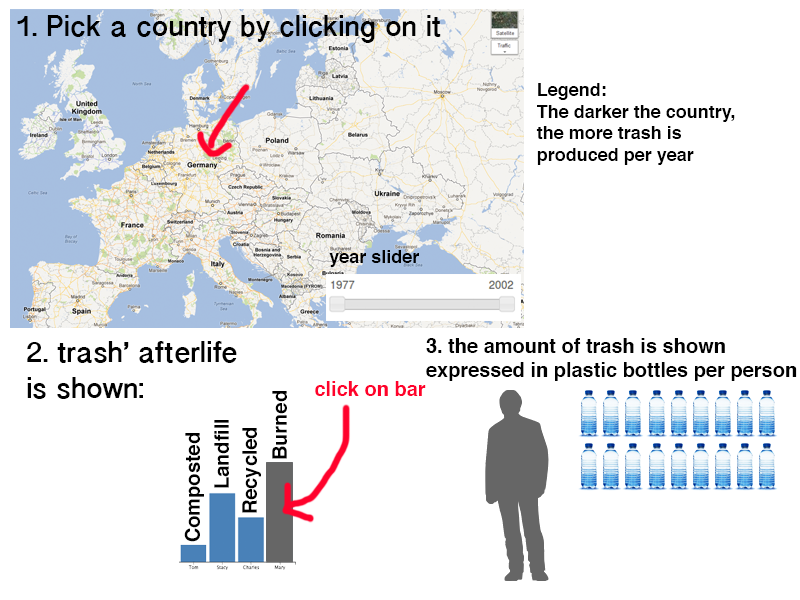

# project

## statement
This data visualisations will create a bigger awareness of the afterlife of our trash and how many trash we produce in Europe.
The target group is everyone living in Europe with access to the internet.

## solution
Bigger awareness will be created by showing how many trash we produce per person per year. This will be expressed in plastic bottles. You can see how much of your trash is recycled, how much ends up in landfill, is composted, burned.

## features
- slide function to load data from 1995 to 2016
- select a country to get the information about the afterlife of the amount of trash
- the afterlife of the trash is shown in a bar chart
- click on a bar of the chart to see the equivalent expressed in bottles of water per person

## minimum viable product (MVP)
As described in the assignment the project needs to contain 3 linked interactive views. This proposal also contains 3 views so all views are necessary to complete the project.
The project also needs 2 interactive components. The proposal contains a slide function to see the values through the years and the user can hover over countries and bars to see new values.
While these components are implemented on the website, the project meets its requirements.

## prerequisites
### data source:
- http://ec.europa.eu/eurostat/web/environment/waste/main-tables
### external components
No external components seem to be needed so far. I'll definitely come across needed components during the project.
### similar visualisation
I found this similar visualisation on the topic:
- http://ec.europa.eu/eurostat/tgm/graph.do?tab=graph&plugin=1&pcode=tsdpc240&language=en&toolbox=data
The message of this visualisation doesn't seem very clear and it doesn't contribute to the awareness of our own trash production. I want to make people feel like little trash factories after they've visited my website.
### hardest parts
The biggest challenge would be to make the plastic bottles differ from amount since it will be a PNG or JPEG image and no standard d3 vector.
